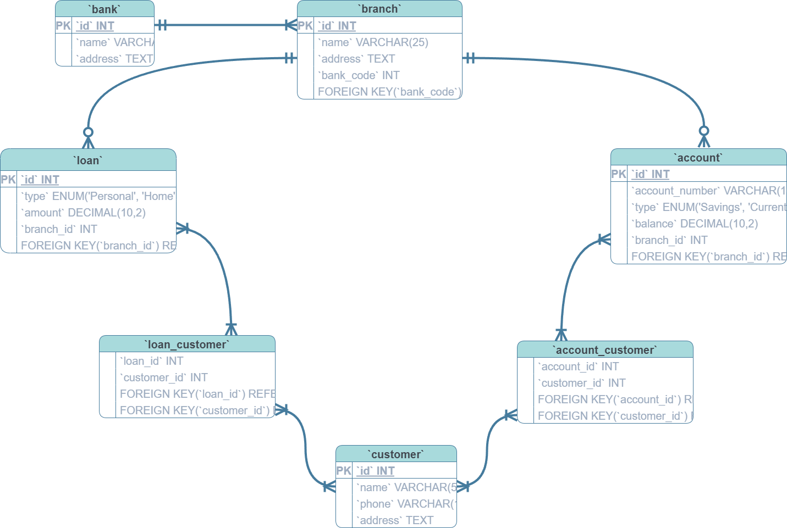

# PROJECT: BANKING SYSTEM
# Design Document

By ANIMESH MAHATA

[VIDEO OVERVIEW](https://youtu.be/qu-KFWDHcFc)

## Scope

The database for BANK includes some of the common entities necessary to facilitate the banking process.

* Banks, including name and address
* Branches of banks, with name and address
* Bank account, includes balance, account type and other basic information
* Customers, including basic identifying information
* Loan by bank, includes the basic information about the loan provided by bank

Out of scope are elements like credit / debit cards and other non-core attributes.

## Functional Requirements

This database will support:

* CRUD operations for bank, branches and customers
* Tracking customer's account and loan

In this iteration, only the admin can manage the database and we can not see the transactions. Also the concept of transaction is not present in this iteration.

## Representation

### Entities

#### banks

    id: INT
    name: VARCHAR       -stores the name of bank
    address: VARCHAR    -stores the address of the bank
    PRIMARY KEY: id

#### branches

    id: INT
    name: VARCHAR       -stores the name of the branch of a particular bank
    address: VARCHAR    -stores the address of the branch
    bank_code: INT      -code of the bank to which the branch belongs
    PRIMARY KEY: id
    FOREIGN KEY: bank_code [referencing bank.id]

#### accounts

    id: INT
    account_number: VARCHAR     -account number which is available publicly
    type: VARCHAR               -the type of account ('Savings', 'Current' or 'Fixed Deposit')
    balance: DECIMAL            -current balance in the account
    branch_id: INT              -id of the branch to which the account belongs
    PRIMARY KEY: id
    FOREIGN KEY: branch_id [referencing branch.id]

#### loans

    id: INT
    type: VARCHAR       -the type of loan ('Personal', 'Home', 'Gold' or 'Education')
    amount: DECIMAL     -the amount of loan(can't exceed the limit of 8 digits)
    branch_id: INT      -id of the branch to which the loan belongs
    PRIMARY KEY: id
    FOREIGN KEY: branch_id [referencing branch.id]

#### account_customers
    account_id: INT
    customer_id: INT
    PRIMARY KEY: (account_id, customer_id)
    FOREIGN KEY: account_id, cusotmer_id [References account.id and customer.id]

#### loan_customers

    loan_id: INT
    customer_id: INT
    PRIMARY KEY: (loan_id, customer_id)
    FOREIGN KEY: loan_id, cusotmer_id

### Relationships

The below entity relationship diagram describes the relationships among the entities in the database.

As detailed by the diagram:

* There may be one or more banks
* One bank may have one or many branches but a branch can have only one bank
* One branch may have zero or many accounts but a account can have only one branch
* One branch may give zero or many loans but loan have to come from a single branch only
* A customer may have one or many accounts as well as loans

## Optimizations

Per the typical queries in `queries.sql`, it is common for users of the database to access customer detail, branch detail, account detail, which customer has which type of loan or which type of account. For that reason, indexes are created on the `customer.name`, `branch.name`, `account_number` and `customer_id` columns namely `idx_customer_name`, `idx_branch_name`, `idx_account_account_number`, `idx_account_customer_customer_id`, `idx_loan_customer_customer_id` respectively to speed up the search process by those columns when the customer density increases significantly.

Similarly, it is also common to view the basic details like balance, account detail, loan detail of a customer for that `customer_details` view is created. The view contains `name of the customer`, `account number`, `type of loan`, `amount of loan` and `account balance` of respective customers.

## Limitations

The current schema assumes only admin accesses the database.
